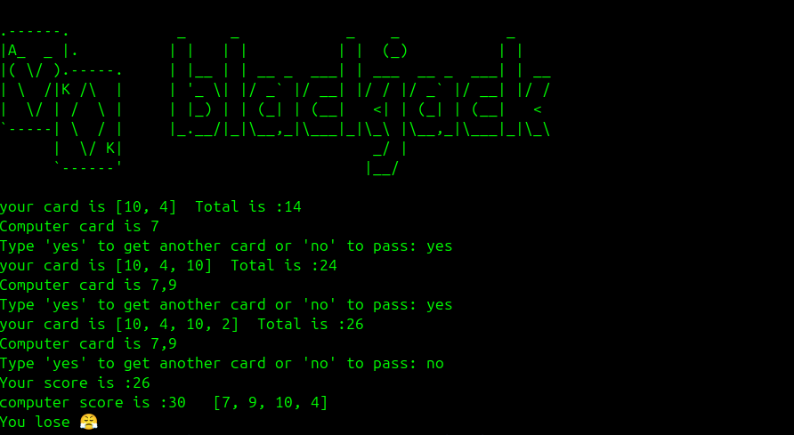

# 🃏 Blackjack Game (Python)

A simple text-based Blackjack game built with Python, where you play against the computer!  
        

---

## 📌 Features

- Play Blackjack against a computer dealer.
- Automatically calculates scores and determines the winner.
- Handles invalid user input gracefully.
- Fun emoji-based feedback on game outcomes.

---

## ▶️ How to Play

1. Run the Python script.   
    ```
    python3 BlackJack.py
    ```
2. Type 'yes' to get another card or 'no' to pass.
3. The computer will play its turn.
4. The game determines who wins based on the final scores:
   - 31 is the perfect score.
   - If both go over 31, there's no winner.
   - If one goes over, the other wins.
   - Highest valid score (≤ 31) wins.


