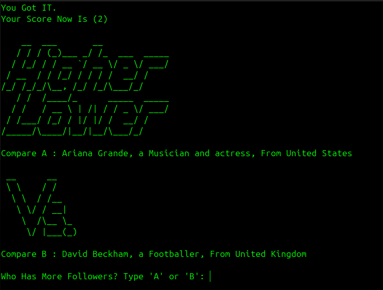

# Comparison Game

This game challenges players to guess who has more followers, keeping track of your score until you make a wrong choice.
   
## Features

- Randomly selects two items to compare.
- Tracks the player's score.
- Easy to extend with new data.

## How to Play

1. Run the game using Python:
   ```bash
   python main.py
   ```
2. For each round, choose which item you think has the higher value.
3. Try to get as many correct answers as possible!


